<picture><source media="(prefers-reduced-motion: reduce) and (max-width: 600px) and (prefers-color-scheme: light)" srcset="assets/hero-mobile-light-still.svg"><source media="(prefers-reduced-motion: reduce) and (max-width: 600px)" srcset="assets/hero-mobile-still.svg"><source media="(prefers-reduced-motion: reduce) and (prefers-color-scheme: light)" srcset="assets/hero-light-still.svg"><source media="(prefers-reduced-motion: reduce)" srcset="assets/hero-dark-still.svg"><source media="(max-width: 600px) and (prefers-color-scheme: light)" srcset="assets/hero-mobile-light.svg"><source media="(max-width: 600px)" srcset="assets/hero-mobile.svg"><source media="(prefers-color-scheme: light)" srcset="assets/hero-light.svg"></picture>

<picture><source media="(prefers-reduced-motion: reduce) and (max-width: 600px) and (prefers-color-scheme: light)" srcset="assets/terminal/whoami-mobile-light-still.svg"><source media="(prefers-reduced-motion: reduce) and (max-width: 600px)" srcset="assets/terminal/whoami-mobile-still.svg"><source media="(prefers-reduced-motion: reduce) and (prefers-color-scheme: light)" srcset="assets/terminal/whoami-light-still.svg"><source media="(prefers-reduced-motion: reduce)" srcset="assets/terminal/whoami-still.svg"><source media="(max-width: 600px) and (prefers-color-scheme: light)" srcset="assets/terminal/whoami-mobile-light.svg"><source media="(max-width: 600px)" srcset="assets/terminal/whoami-mobile.svg"><source media="(prefers-color-scheme: light)" srcset="assets/terminal/whoami-light.svg"></picture>

<picture><source media="(prefers-reduced-motion: reduce) and (max-width: 600px) and (prefers-color-scheme: light)" srcset="assets/activity/contribution-heatmap-mobile-light.svg"><source media="(prefers-reduced-motion: reduce) and (max-width: 600px)" srcset="assets/activity/contribution-heatmap-mobile.svg"><source media="(prefers-reduced-motion: reduce) and (prefers-color-scheme: light)" srcset="assets/activity/contribution-heatmap-light-still.svg"><source media="(prefers-reduced-motion: reduce)" srcset="assets/activity/contribution-heatmap-still.svg"><source media="(max-width: 600px) and (prefers-color-scheme: light)" srcset="assets/activity/contribution-heatmap-mobile-light.svg"><source media="(max-width: 600px)" srcset="assets/activity/contribution-heatmap-mobile.svg"><source media="(prefers-color-scheme: light)" srcset="assets/activity/contribution-heatmap-light.svg"></picture>

Account calendar includes intentional contribution art. Engineering signals below exclude profile and art repositories.

<picture><source media="(prefers-reduced-motion: reduce) and (max-width: 600px) and (prefers-color-scheme: light)" srcset="assets/activity/current-signal-mobile-light.svg"><source media="(prefers-reduced-motion: reduce) and (max-width: 600px)" srcset="assets/activity/current-signal-mobile.svg"><source media="(prefers-reduced-motion: reduce) and (prefers-color-scheme: light)" srcset="assets/activity/current-signal-light.svg"><source media="(prefers-reduced-motion: reduce)" srcset="assets/activity/current-signal.svg"><source media="(max-width: 600px) and (prefers-color-scheme: light)" srcset="assets/activity/current-signal-mobile-light.svg"><source media="(max-width: 600px)" srcset="assets/activity/current-signal-mobile.svg"><source media="(prefers-color-scheme: light)" srcset="assets/activity/current-signal-light.svg"></picture>

<picture><source media="(prefers-reduced-motion: reduce) and (max-width: 600px) and (prefers-color-scheme: light)" srcset="assets/sections/systems-mobile-light.svg"><source media="(prefers-reduced-motion: reduce) and (max-width: 600px)" srcset="assets/sections/systems-mobile.svg"><source media="(prefers-reduced-motion: reduce) and (prefers-color-scheme: light)" srcset="assets/sections/systems-light.svg"><source media="(prefers-reduced-motion: reduce)" srcset="assets/sections/systems.svg"><source media="(max-width: 600px) and (prefers-color-scheme: light)" srcset="assets/sections/systems-mobile-light.svg"><source media="(max-width: 600px)" srcset="assets/sections/systems-mobile.svg"><source media="(prefers-color-scheme: light)" srcset="assets/sections/systems-light.svg"></picture>

<a href="https://github.com/sultankassam/jarvis"><picture><source media="(prefers-reduced-motion: reduce) and (max-width: 600px) and (prefers-color-scheme: light)" srcset="assets/projects/project-01-mobile-light-still.svg"><source media="(prefers-reduced-motion: reduce) and (max-width: 600px)" srcset="assets/projects/project-01-mobile-still.svg"><source media="(prefers-reduced-motion: reduce) and (prefers-color-scheme: light)" srcset="assets/projects/project-01-light-still.svg"><source media="(prefers-reduced-motion: reduce)" srcset="assets/projects/project-01-still.svg"><source media="(max-width: 600px) and (prefers-color-scheme: light)" srcset="assets/projects/project-01-mobile-light.svg"><source media="(max-width: 600px)" srcset="assets/projects/project-01-mobile.svg"><source media="(prefers-color-scheme: light)" srcset="assets/projects/project-01-light.svg">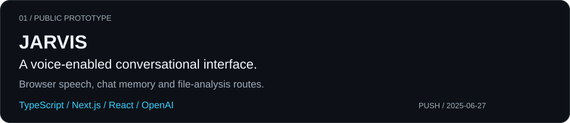</picture></a>

<a href="https://github.com/sultankassam/AutoMod"><picture><source media="(prefers-reduced-motion: reduce) and (max-width: 600px) and (prefers-color-scheme: light)" srcset="assets/projects/project-02-mobile-light-still.svg"><source media="(prefers-reduced-motion: reduce) and (max-width: 600px)" srcset="assets/projects/project-02-mobile-still.svg"><source media="(prefers-reduced-motion: reduce) and (prefers-color-scheme: light)" srcset="assets/projects/project-02-light-still.svg"><source media="(prefers-reduced-motion: reduce)" srcset="assets/projects/project-02-still.svg"><source media="(max-width: 600px) and (prefers-color-scheme: light)" srcset="assets/projects/project-02-mobile-light.svg"><source media="(max-width: 600px)" srcset="assets/projects/project-02-mobile.svg"><source media="(prefers-color-scheme: light)" srcset="assets/projects/project-02-light.svg">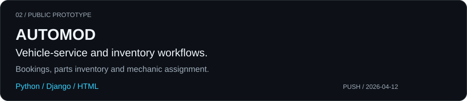</picture></a>

<picture><source media="(prefers-reduced-motion: reduce) and (max-width: 600px) and (prefers-color-scheme: light)" srcset="assets/system-map-mobile-light.svg"><source media="(prefers-reduced-motion: reduce) and (max-width: 600px)" srcset="assets/system-map-mobile.svg"><source media="(prefers-reduced-motion: reduce) and (prefers-color-scheme: light)" srcset="assets/system-map-light-still.svg"><source media="(prefers-reduced-motion: reduce)" srcset="assets/system-map-still.svg"><source media="(max-width: 600px) and (prefers-color-scheme: light)" srcset="assets/system-map-mobile-light.svg"><source media="(max-width: 600px)" srcset="assets/system-map-mobile.svg"><source media="(prefers-color-scheme: light)" srcset="assets/system-map-light.svg"></picture>

<picture><source media="(prefers-reduced-motion: reduce) and (max-width: 600px) and (prefers-color-scheme: light)" srcset="assets/matrix-mobile-light.svg"><source media="(prefers-reduced-motion: reduce) and (max-width: 600px)" srcset="assets/matrix-mobile.svg"><source media="(prefers-reduced-motion: reduce) and (prefers-color-scheme: light)" srcset="assets/matrix-light.svg"><source media="(prefers-reduced-motion: reduce)" srcset="assets/matrix.svg"><source media="(max-width: 600px) and (prefers-color-scheme: light)" srcset="assets/matrix-mobile-light.svg"><source media="(max-width: 600px)" srcset="assets/matrix-mobile.svg"><source media="(prefers-color-scheme: light)" srcset="assets/matrix-light.svg"></picture>

<picture><source media="(prefers-reduced-motion: reduce) and (max-width: 600px) and (prefers-color-scheme: light)" srcset="assets/build-pipeline-mobile-light.svg"><source media="(prefers-reduced-motion: reduce) and (max-width: 600px)" srcset="assets/build-pipeline-mobile.svg"><source media="(prefers-reduced-motion: reduce) and (prefers-color-scheme: light)" srcset="assets/build-pipeline-light.svg"><source media="(prefers-reduced-motion: reduce)" srcset="assets/build-pipeline.svg"><source media="(max-width: 600px) and (prefers-color-scheme: light)" srcset="assets/build-pipeline-mobile-light.svg"><source media="(max-width: 600px)" srcset="assets/build-pipeline-mobile.svg"><source media="(prefers-color-scheme: light)" srcset="assets/build-pipeline-light.svg"></picture>

<picture><source media="(prefers-reduced-motion: reduce) and (max-width: 600px) and (prefers-color-scheme: light)" srcset="assets/footer-mobile-light.svg"><source media="(prefers-reduced-motion: reduce) and (max-width: 600px)" srcset="assets/footer-mobile.svg"><source media="(prefers-reduced-motion: reduce) and (prefers-color-scheme: light)" srcset="assets/footer-light.svg"><source media="(prefers-reduced-motion: reduce)" srcset="assets/footer.svg"><source media="(max-width: 600px) and (prefers-color-scheme: light)" srcset="assets/footer-mobile-light.svg"><source media="(max-width: 600px)" srcset="assets/footer-mobile.svg"><source media="(prefers-color-scheme: light)" srcset="assets/footer-light.svg"></picture>

[GitHub ↗](https://github.com/sultankassam) · [Public projects ↗](https://github.com/sultankassam?tab=repositories)

Public prototypes · Daily snapshots, not live presence. [Data methodology](docs/DESIGN.md) · [Pass 3 research](docs/PROFILE_RESEARCH.md).
